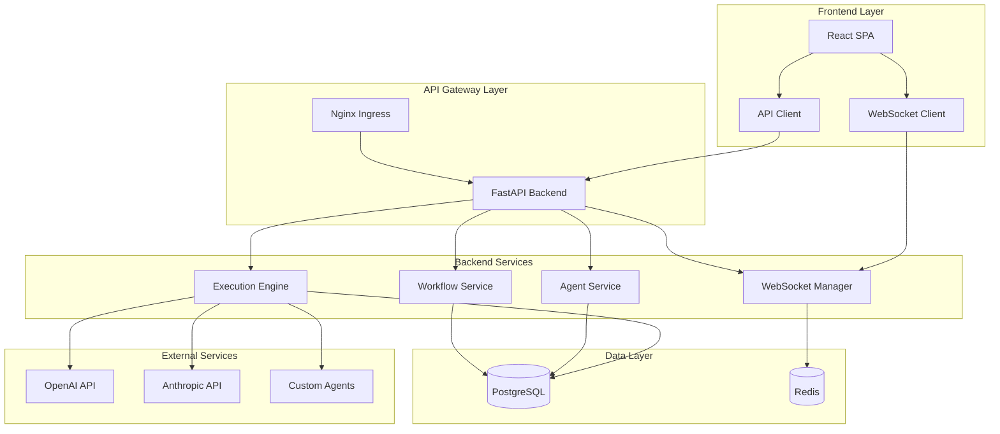

# AgentFlow Architecture Documentation

## Overview

AgentFlow is a visual multi-agent workflow designer platform built with modern microservices architecture. The system enables developers to create, deploy, and monitor AI agent workflows through an intuitive drag-and-drop interface.

## System Architecture

### High-Level Architecture



## Frontend Architecture

### Technology Stack

- **Framework**: React 18 with TypeScript
- **State Management**: Zustand
- **UI Library**: Custom components with Tailwind CSS
- **Workflow Visualization**: ReactFlow
- **Code Editor**: Monaco Editor
- **Real-time Communication**: Socket.IO Client
- **Build Tool**: Vite

### Component Structure

```
src/
├── components/
│   ├── ui/                 # Reusable UI components
│   ├── workflow/           # Workflow-specific components
│   ├── agents/             # Agent-related components
│   └── monitoring/         # Monitoring and analytics
├── pages/                  # Route components
├── hooks/                  # Custom React hooks
├── stores/                 # Zustand state stores
├── types/                  # TypeScript type definitions
├── utils/                  # Utility functions
└── constants/              # Application constants
```

### Key Components

#### WorkflowEditor
The core component for visual workflow design:

```typescript
interface WorkflowEditorProps {
  workflowId?: string;
  isReadOnly?: boolean;
  onSave?: (workflow: WorkflowData) => void;
}
```

**Features:**
- Drag-and-drop agent placement
- Real-time collaboration
- Visual workflow validation
- Auto-save functionality

#### AgentNode
Custom ReactFlow node for agents:

```typescript
interface AgentNodeData {
  agentType: string;
  config: Record<string, any>;
  label: string;
  status?: 'idle' | 'running' | 'completed' | 'error';
}
```

**Features:**
- Status visualization
- Configuration editing
- Execution monitoring
- Error handling

### State Management

#### Workflow Store
Manages workflow state and execution:

```typescript
interface WorkflowState {
  currentWorkflow: WorkflowData | null;
  isExecuting: boolean;
  executionLogs: ExecutionLog[];
  selectedNodes: string[];
  sidebarOpen: boolean;
}
```

#### Auth Store
Handles authentication state:

```typescript
interface AuthState {
  user: User | null;
  token: string | null;
  isAuthenticated: boolean;
  isLoading: boolean;
}
```

## Backend Architecture

### Technology Stack

- **Framework**: FastAPI (Python 3.11+)
- **Database**: PostgreSQL with Supabase
- **Cache**: Redis
- **Task Queue**: Celery (planned)
- **Monitoring**: Prometheus + Grafana
- **Containerization**: Docker

### Service Architecture

```
backend/
├── app/
│   ├── api/                # API route handlers
│   ├── core/               # Core configuration
│   ├── models/             # SQLAlchemy models
│   ├── schemas/            # Pydantic schemas
│   ├── services/           # Business logic
│   └── agents/             # Custom agent implementations
├── migrations/             # Database migrations
└── tests/                  # Test suite
```

### Core Services

#### Workflow Service
Handles workflow CRUD operations:

```python
class WorkflowService:
    async def create_workflow(self, user_id: UUID, workflow_data: WorkflowCreate) -> Workflow:
        """Create a new workflow with validation"""
    
    async def execute_workflow(self, workflow_id: UUID, input_data: Dict) -> ExecutionResult:
        """Execute a workflow with error handling"""
```

#### Execution Engine
Core workflow execution logic:

```python
class ExecutionEngine:
    async def execute_workflow(self, workflow_data: Dict, input_data: Dict) -> Dict:
        """Execute workflow with parallel agent execution"""
    
    def _build_execution_graph(self, nodes: List[Dict], edges: List[Dict]) -> Dict:
        """Build execution graph from workflow data"""
```

#### Agent Runner
Manages agent execution:

```python
class AgentRunner:
    async def execute_agent(self, agent_type: str, config: Dict, input_data: Dict) -> Dict:
        """Execute individual agents with timeout and error handling"""
```

### API Design

#### RESTful Endpoints

```
GET    /api/workflows           # List workflows
POST   /api/workflows           # Create workflow
GET    /api/workflows/{id}      # Get workflow
PUT    /api/workflows/{id}      # Update workflow
DELETE /api/workflows/{id}      # Delete workflow
POST   /api/workflows/{id}/execute  # Execute workflow

GET    /api/agents              # List agents
GET    /api/agents/{id}         # Get agent

GET    /api/executions          # List executions
GET    /api/executions/{id}     # Get execution
POST   /api/executions/{id}/cancel  # Cancel execution
```

#### WebSocket Endpoints

```
WS /ws/{workflow_id}            # Real-time collaboration
```

### Database Design

#### Core Tables

```sql
-- User profiles
CREATE TABLE profiles (
    id UUID PRIMARY KEY,
    username TEXT UNIQUE NOT NULL,
    full_name TEXT,
    created_at TIMESTAMP WITH TIME ZONE DEFAULT NOW()
);

-- Workflows
CREATE TABLE workflows (
    id UUID PRIMARY KEY,
    user_id UUID REFERENCES profiles(id),
    name TEXT NOT NULL,
    workflow_data JSONB NOT NULL,
    execution_config JSONB NOT NULL,
    created_at TIMESTAMP WITH TIME ZONE DEFAULT NOW()
);

-- Agents
CREATE TABLE agents (
    id UUID PRIMARY KEY,
    name TEXT NOT NULL,
    display_name TEXT NOT NULL,
    config_schema JSONB NOT NULL,
    is_builtin BOOLEAN DEFAULT FALSE
);

-- Executions
CREATE TABLE workflow_executions (
    id UUID PRIMARY KEY,
    workflow_id UUID REFERENCES workflows(id),
    status TEXT DEFAULT 'running',
    input_data JSONB,
    output_data JSONB,
    started_at TIMESTAMP WITH TIME ZONE DEFAULT NOW()
);
```

#### Indexes and Performance

```sql
-- Performance indexes
CREATE INDEX idx_workflows_user_id ON workflows(user_id);
CREATE INDEX idx_workflow_executions_workflow_id ON workflow_executions(workflow_id);
CREATE INDEX idx_workflow_executions_status ON workflow_executions(status);

-- Full-text search
CREATE INDEX idx_workflows_search ON workflows USING gin(to_tsvector('english', name || ' ' || description));
```

#### Row Level Security (RLS)

```sql
-- Enable RLS
ALTER TABLE workflows ENABLE ROW LEVEL SECURITY;

-- Policies
CREATE POLICY "Users can view own workflows" ON workflows
    FOR SELECT USING (user_id = auth.uid());
```

## Agent System

### Agent Interface

All agents implement a standard interface:

```python
class AgentInterface:
    async def execute(self, input_data: Dict[str, Any], context: Any) -> Dict[str, Any]:
        """Execute agent with input data and return results"""
        pass
```

### Built-in Agents

#### LLM Text Generator
- **Purpose**: Generate text using large language models
- **Input**: Prompt, temperature, max_tokens
- **Output**: Generated text, variables

#### Code Analyzer
- **Purpose**: Analyze code for quality and security
- **Input**: Code, language
- **Output**: Analysis results, recommendations

#### Data Processor
- **Purpose**: Process and transform data
- **Input**: Data, operation, parameters
- **Output**: Processed data, metadata

### Custom Agent Development

```python
class CustomAgent(AgentInterface):
    def __init__(self, config: Dict[str, Any], llm=None):
        self.config = config
        self.llm = llm
        self._validate_config()
    
    async def execute(self, input_data: Dict[str, Any], context: Any) -> Dict[str, Any]:
        # Custom agent logic
        result = await self._process_data(input_data)
        
        return {
            'output': result,
            'variables': self._extract_variables(result),
            'metadata': {
                'execution_time': time.time() - start_time,
                'agent_type': 'custom'
            }
        }
```

## Real-time Features

### WebSocket Manager

```python
class ConnectionManager:
    async def connect(self, websocket: WebSocket, workflow_id: str):
        """Handle new WebSocket connection"""
    
    async def broadcast_to_workflow(self, workflow_id: str, message: Dict):
        """Broadcast message to all workflow subscribers"""
```

### Collaboration Features

- **Real-time Cursors**: Show other users' cursor positions
- **Live Updates**: Sync workflow changes across users
- **Chat**: In-workflow communication
- **Presence**: Show active users

## Security Architecture

### Authentication

- **JWT Tokens**: Stateless authentication
- **Refresh Tokens**: Secure token renewal
- **Rate Limiting**: Prevent abuse

### Authorization

- **Row Level Security**: Database-level access control
- **API Permissions**: Endpoint-level authorization
- **Resource Ownership**: User-specific data access

### Data Protection

- **Input Validation**: Pydantic schemas
- **SQL Injection Prevention**: SQLAlchemy ORM
- **XSS Protection**: Content sanitization
- **CORS Configuration**: Controlled cross-origin access

## Monitoring and Observability

### Metrics Collection

```python
# Prometheus metrics
workflow_executions = Counter(
    'agentflow_workflow_executions_total',
    'Total workflow executions',
    ['status', 'workflow_type']
)

agent_duration = Histogram(
    'agentflow_agent_duration_seconds',
    'Agent execution duration',
    ['agent_type']
)
```

### Logging

```python
# Structured logging
logger.info(
    "workflow_execution_started",
    workflow_id=workflow_id,
    user_id=user_id,
    execution_id=execution_id
)
```

### Health Checks

```python
@app.get("/health")
async def health_check():
    return {
        "status": "healthy",
        "timestamp": datetime.utcnow().isoformat(),
        "checks": {
            "database": await check_database(),
            "redis": await check_redis(),
            "external_apis": await check_external_apis()
        }
    }
```

## Deployment Architecture

### Containerization

```dockerfile
# Backend Dockerfile
FROM python:3.11-slim
WORKDIR /app
COPY requirements.txt .
RUN pip install -r requirements.txt
COPY . .
CMD ["uvicorn", "main:app", "--host", "0.0.0.0", "--port", "8000"]
```

### Kubernetes Deployment

```yaml
apiVersion: apps/v1
kind: Deployment
metadata:
  name: agentflow-backend
spec:
  replicas: 3
  selector:
    matchLabels:
      app: agentflow-backend
  template:
    spec:
      containers:
      - name: backend
        image: agentflow/backend:latest
        ports:
        - containerPort: 8000
```

### Environment Configuration

```yaml
# Development
DATABASE_URL: "postgresql://localhost/agentflow_dev"
REDIS_URL: "redis://localhost:6379"
DEBUG: true

# Production
DATABASE_URL: "${DATABASE_URL}"
REDIS_URL: "${REDIS_URL}"
DEBUG: false
MONITORING_ENABLED: true
```

## Performance Considerations

### Frontend Optimization

- **Code Splitting**: Route-based lazy loading
- **Memoization**: React.memo for expensive components
- **Virtualization**: Large list rendering
- **Caching**: API response caching

### Backend Optimization

- **Connection Pooling**: Database connection management
- **Caching**: Redis for frequently accessed data
- **Async Processing**: Non-blocking I/O operations
- **Background Tasks**: Long-running operations

### Database Optimization

- **Indexing**: Strategic index placement
- **Query Optimization**: Efficient SQL queries
- **Connection Pooling**: Reuse database connections
- **Read Replicas**: Distribute read load

## Scalability

### Horizontal Scaling

- **Load Balancing**: Distribute traffic across instances
- **Auto-scaling**: Dynamic resource allocation
- **Microservices**: Independent service scaling

### Vertical Scaling

- **Resource Allocation**: CPU and memory optimization
- **Database Tuning**: Query and index optimization
- **Caching Strategy**: Multi-level caching

## Future Architecture Considerations

### Planned Features

- **Multi-tenancy**: Isolated tenant environments
- **Plugin System**: Extensible agent architecture
- **Workflow Versioning**: Git-like version control
- **Advanced Analytics**: ML-powered insights

### Technology Evolution

- **Edge Computing**: Distributed execution
- **GraphQL**: Flexible API queries
- **Event Sourcing**: Audit trail and replay
- **CQRS**: Command Query Responsibility Segregation

## Development Workflow

### Local Development

```bash
# Start development environment
docker-compose up -d

# Run tests
pytest backend/tests/
npm test frontend/

# Code quality
black backend/
eslint frontend/src/
```

### CI/CD Pipeline

```yaml
# GitHub Actions workflow
name: CI/CD
on: [push, pull_request]
jobs:
  test:
    runs-on: ubuntu-latest
    steps:
      - uses: actions/checkout@v3
      - name: Run tests
        run: |
          pytest backend/tests/
          npm test frontend/
  
  deploy:
    needs: test
    runs-on: ubuntu-latest
    steps:
      - name: Deploy to production
        run: |
          kubectl apply -f k8s/
```

This architecture provides a solid foundation for building a scalable, maintainable, and feature-rich multi-agent workflow platform.


